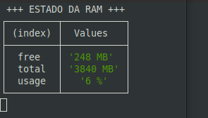

<p align='center'>
  
</p>

<h1 align='center'>MemoryRAM-monitor</h1>
Monitor and Reader of RAM disk memory.

Uma aplicação construída com nodeJS para monitorar e ler a quantidade de uso de memória RAM da máquina na qual está sendo executada. Através do uso do setInterval() para controlar o tempo de execução e o import da função ```os``` do core do Node, afim de obter parâmetros da CPU coletadas através do ```os.freemen``` e ```os.total.mem```. 
